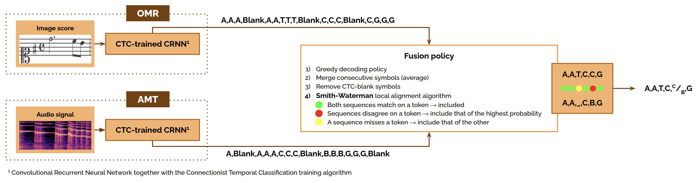

<p align="center">
  <a href=""></a>
</p>

<h1 align="center">Multimodal image and audio music transcription</h1>

<h4 align="center">Full text available <a href="https://link.springer.com/article/10.1007/s13735-021-00221-6" target="_blank">here</a>.</h4>

<p align="center">
  
  
  
</p>


<p align="center">
  <a href="#about">About</a> •
  <a href="#how-to-use">How To Use</a> •
  <a href="#citations">Citations</a> •
  <a href="#acknowledgments">Acknowledgments</a> •
  <a href="#license">License</a>
</p>


## About

We propose a multimodal framework to align the greedy predictions provided by Optical Music Recognition (OMR) and Automatic Music Transcription (AMT)[^1] models using the [Smith-Waterman](https://www.sciencedirect.com/science/article/abs/pii/0022283681900875) (SW) local alignment algorithm. 

[^1]: It is important to clarify that the model we are referring to is actually an Audio-to-Score (A2S) model. At the time of conducting this research, we used the term AMT because the distinction between AMT and A2S did not exist in the literature. However, nowadays, there is a clear distinction between the two. AMT typically focuses on note-level transcription, encoding the acoustic piece in terms of onset, offset, pitch values, and the musical instrument of the estimated notes. In contrast, A2S aims to achieve a score-level codification.

<p align="center">
  
</p>

Given that the best paths from both models may have different lengths, the SW algorithm aligns the two estimations by searching for the most similar regions between them. The final estimation is eventually obtained from these two aligned sequences by following these premises: 
1) If both sequences match a symbol, it is included in the resulting estimation.
2) If they disagree, the symbol with the highest probability is included in the estimation.
3) If one of the sequences lacks a symbol, that of the other sequence is included in the estimation.

## How To Use

### Dataset

We use the [**Camera-PrIMuS**](https://grfia.dlsi.ua.es/primus/) dataset.

The Camera-PrIMuS dataset contains 87&nbsp;678[^2] real-music incipits[^3], each represented by six files: (i) the Plaine and Easie code source, (ii) an image with the rendered score, (iii) a distorted image, (iv) the musical symbolic representation of the incipit both in Music Encoding Initiative format (MEI) and (v) in an on-purpose simplified encoding (semantic encoding), and (vi) a sequence containing the graphical symbols shown in the score with their position in the staff without any musical meaning (agnostic encoding).

[^2]: In this work, we consider 22&nbsp;285 samples out of the total 87&nbsp;678 that constitute the complete Camera-PrIMuS dataset. This selection resulted from a data curation process, primarily involving the removal of samples containing long multi-rests. These music events contribute minimally to the length of the score image but may span a large number of frames in the audio signal.

[^3]: An incipit is a sequence of notes, typically the first ones, used for identifying a melody or musical work.

To obtain the corresponding audio files, we must convert one of the provided representations to MIDI and then synthesize the MIDI data. We have opted to convert the semantic representation, as there is a publicly available semantic-to-MIDI converter. Once we have obtained the MIDI files, we render them using FluidSynth.

The specific steps to follow are:
1) Download the semantic-to-MIDI converter from [here](https://grfia.dlsi.ua.es/primus/primus_converter.tgz) and **place the `omr-3.0-SNAPSHOT.jar` file in the [`dataset`](dataset) folder**.
2) Download a [General MIDI SounFont (sf2)](https://sites.google.com/site/soundfonts4u/#h.p_biJ8J359lC5W). We recommend downloading the [SGM-v2.01 soundfont](https://drive.google.com/file/d/12zSPpFucZXFg-svKeu6dm7-Fe5m20xgJ/view) as this code has been tested using this soundfont. **Place the sf2 file in the [`dataset`](dataset) folder.**

## Experiments

We considered four controlled scenarios to thoroughly evaluate the multimodal transcription approach:
1) **Scenario A: OMR <sub>Symbol Error Rate</sub> ~ AMT <sub>Symbol Error Rate</sub>**
<br>OMR model is trained using only 2.5% of the original training partition, while AMT uses the complete original training partition.
2) **Scenario B: OMR <sub>Symbol Error Rate</sub> < AMT <sub>Symbol Error Rate</sub>**
<br>OMR model is trained using only 4% of the original training partition, while AMT uses the complete original training partition.
3) **Scenario C: OMR <sub>Symbol Error Rate</sub> ~ AMT <sub>Symbol Error Rate</sub>**
<br>OMR model is trained using only 4% of the original training partition, while AMT uses the complete original training partition. Both models are evaluated on a subset of the original test partition, created based on the performance of the AMT model on such partition. This allows us to achieve lower error rates than those in Scenario 1.
4) **Scenario D: OMR <sub>Symbol Error Rate</sub> << AMT <sub>Symbol Error Rate</sub>**
<br>Both OMR and AMT models are trained using the original training partition.


To replicate our experiments, you will first need to meet certain requirements specified in the [`Dockerfile`](Dockerfile). Alternatively, you can set up a virtual environment if preferred. Once you have prepared your environment (either a Docker container or a virtual environment) and followed the steps in the [dataset](#dataset) section, you are ready to begin. Follow this recipe to replicate our experiments:

> **Important note: To execute the following code, both Java and FluidSynth must be installed.**

```bash
$ cd dataset
$ sh prepare_data.sh
$ cd ..
$ python main.py
```

## Citations

```bibtex
@article{delaFuente2022multimodal,
  title     = {{Multimodal image and audio music transcription}},
  author    = {de la Fuente, Carlos and Valero-Mas, Jose J and Castellanos, Francisco J and Calvo-Zaragoza, Jorge},
  journal   = {{International Journal of Multimedia Information Retrieval}},
  pages     = {77--84},
  year      = {2022},
  publisher = {Springer},
  volume    = {11},
  number    = {1},
  doi       = {10.1007/s13735-021-00221-6},
}
@inproceedings{delafuente2021multimodal,
  author    = {de la Fuente, Carlos and Valero-Mas, Jose J. and Castellanos, Francisco J. and Calvo-Zaragoza, Jorge and Alfaro-Contreras, Mar{\'i}a and I{\~n}esta, Jose M. },
  title     = {{Multimodal audio and image music transcription}},
  booktitle = {{Late-breaking Demo at the 22nd International Society for Music Information Retrieval (ISMIR) Conference}},
  year      = {2021},
  month     = nov,
  address   = {Online},
}
```

## Acknowledgments

This work is part of the I+D+i PID2020-118447RA-I00 ([MultiScore](https://sites.google.com/view/multiscore-project)) project, funded by MCIN/AEI/10.13039/501100011033.

## License
This work is under a [MIT](LICENSE) license.
